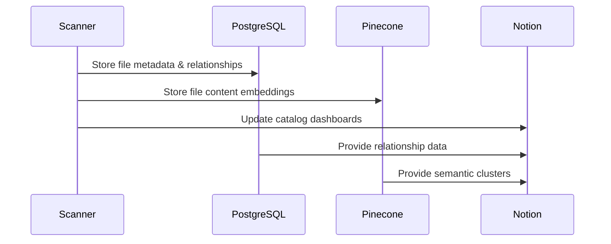
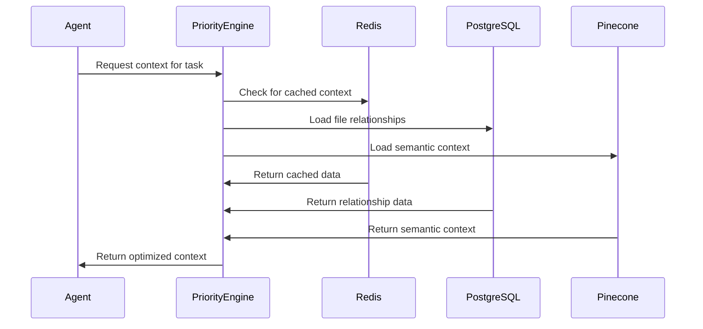
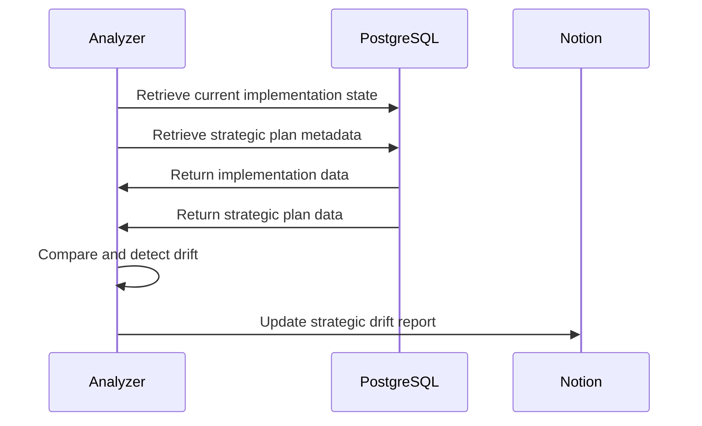

# SecondBrain Context Catalog System - Architecture Diagram

```mermaid
graph TD
    %% Main Components
    User(User / CLI Session)
    ContextCatalog[Context Catalog System]
    ThreeLayerPersistence[Three-Layer Persistence]
    CLI[CLI Tools]
    Agents[Agent System]
    Notion[Notion Integration]
    
    %% Three-Layer Persistence Subcomponents
    Redis[Redis Layer<br>Short-term]
    PostgreSQL[PostgreSQL Layer<br>Medium-term]
    Pinecone[Pinecone Layer<br>Long-term]
    
    %% Context Catalog Subcomponents
    Scanner[File Scanner]
    Analyzer[Strategic Analyzer]
    RelationshipTracker[Relationship Tracker]
    PriorityEngine[Context Priority Engine]
    Visualizer[Visualization Engine]
    
    %% Agent Subcomponents
    PlannerAgent[Planner Agent]
    ExecutorAgent[Executor Agent]
    ReviewerAgent[Reviewer Agent]
    RefactorAgent[Refactor Agent]
    BuildAgent[Build Agent]
    OrchestratorAgent[Orchestrator Agent]
    
    %% CLI Subcomponents
    ContextLoader[Context Loader]
    ContextMap[Context Mapper]
    ContextAudit[Context Auditor]
    ContextViz[Context Visualizer]
    
    %% Notion Subcomponents
    StrategicDashboard[Strategic Dashboard]
    ProjectWorkspaces[Project Workspaces]
    DependencyMaps[Dependency Maps]
    StatusTrackers[Status Trackers]
    
    %% Connections
    User --> CLI
    User --> Agents
    
    CLI --> ContextCatalog
    Agents --> ContextCatalog
    ContextCatalog --> Notion
    
    %% Three-Layer Persistence Connections
    ThreeLayerPersistence --> Redis
    ThreeLayerPersistence --> PostgreSQL
    ThreeLayerPersistence --> Pinecone
    
    ContextCatalog --> ThreeLayerPersistence
    
    %% Context Catalog Internal
    ContextCatalog --> Scanner
    ContextCatalog --> Analyzer
    ContextCatalog --> RelationshipTracker
    ContextCatalog --> PriorityEngine
    ContextCatalog --> Visualizer
    
    %% Agent Connections
    Agents --> PlannerAgent
    Agents --> ExecutorAgent
    Agents --> ReviewerAgent
    Agents --> RefactorAgent
    Agents --> BuildAgent
    Agents --> OrchestratorAgent
    
    %% CLI Connections
    CLI --> ContextLoader
    CLI --> ContextMap
    CLI --> ContextAudit
    CLI --> ContextViz
    
    %% Notion Connections
    Notion --> StrategicDashboard
    Notion --> ProjectWorkspaces
    Notion --> DependencyMaps
    Notion --> StatusTrackers
    
    %% Detailed Interactions
    Scanner --> PostgreSQL
    RelationshipTracker --> PostgreSQL
    PriorityEngine --> Redis
    Scanner --> Pinecone
    
    ContextLoader --> Redis
    ContextLoader --> PriorityEngine
    
    PlannerAgent --> ContextLoader
    ExecutorAgent --> ContextLoader
    ReviewerAgent --> ContextLoader
    
    Analyzer --> StrategicDashboard
    RelationshipTracker --> DependencyMaps
    Visualizer --> DependencyMaps
    
    %% Styling
    classDef primary fill:#f9f,stroke:#333,stroke-width:2px;
    classDef secondary fill:#bbf,stroke:#33f,stroke-width:1px;
    classDef tertiary fill:#bfb,stroke:#3f3,stroke-width:1px;
    classDef storage fill:#fcb,stroke:#f80,stroke-width:1px;
    
    class ContextCatalog,ThreeLayerPersistence,Agents,CLI,Notion primary;
    class Scanner,Analyzer,RelationshipTracker,PriorityEngine,Visualizer secondary;
    class PlannerAgent,ExecutorAgent,ReviewerAgent,RefactorAgent,BuildAgent,OrchestratorAgent tertiary;
    class Redis,PostgreSQL,Pinecone storage;
```

## System Data Flow

The Context Catalog System integrates with the three-layer persistence architecture through the following key data flows:

### 1. Scanning & Cataloging Flow

### 2. Context Loading Flow

### 3. Drift Detection Flow

This architecture ensures:

1. **Never Truncate Principle**: The Context Catalog preserves complete relationship information and deep context
2. **Three-Layer Integration**: Seamless integration with the existing persistence layers
3. **Strategic Alignment**: Continuous verification of implementation against strategic plans
4. **Agent Empowerment**: Agents receive optimized but never truncated context for their tasks
5. **Human Oversight**: All information is available for review in Notion