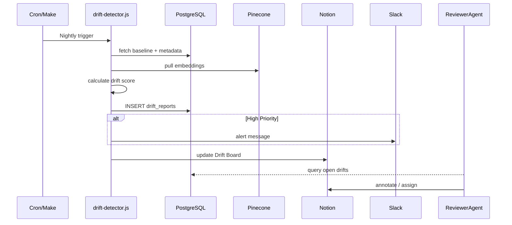

# Drift Detection Implementation Plan

## Purpose

Detect, quantify, and surface any misalignment ("drift") between **strategic intent** and **actual implementation** across the entire SecondBrain code‑base. This closes the feedback‑loop left partially implemented by the Context Catalog and guarantees continuous fidelity to the Prime Directive.

---

## Objectives

|  #  |  Goal                                                                    |  Success Metric                                                                 |
| --- | ------------------------------------------------------------------------ | ------------------------------------------------------------------------------- |
|  1  |  Catch every file or dependency that diverges from latest strategic docs |  ≥ 95 % of drifts surfaced within 24 h of introduction                          |
|  2  |  Prioritise drift by business impact                                     |  Priority score (1‑100) computed for each drift with ≥ 90 % reviewer agreement  |
|  3  |  Route actionable drift to appropriate agent                             |  100 % of high‑priority drifts create tasks in Notion & Slack                   |
|  4  |  Generate historical trend reports                                       |  Weekly drift delta chart visible in Notion dashboard                           |

---

## System Components

### 1 . `drift‑detector.js`

Node script executed by cron / Make.com. Responsibilities:

1. Pull **strategic baseline** ⇒ from `STRATEGIC_COMPONENTS` & latest Pinecone embeddings of design docs.
2. Pull **implementation snapshot** ⇒ from `FILE_METADATA`, `FILE_RELATIONSHIPS`, commit hashes.
3. Compare via **three checks**:

   * **Schema Drift** – file/location changes vs baseline list.
   * **Semantic Drift** – cosine distance between new embeddings & baseline concept vectors.
   * **Behavioural Drift** – changed public function signatures / exports.
4. Compute **Drift Score**:

```
Drift Score = 0.5*Semantic + 0.3*Schema + 0.2*Behavioural
```

5. Persist results to `DRIFT_REPORTS` table.
6. Push high‑priority (>70) items to Notion **Drift Board** & Slack channel `#sb_drift_alerts`.

### 2 . `DRIFT_REPORTS` (PostgreSQL)

```sql
CREATE TABLE IF NOT EXISTS drift_reports (
  id                SERIAL PRIMARY KEY,
  file_id           INT REFERENCES files(id),
  strategic_comp_id INT REFERENCES strategic_components(id),
  drift_score       NUMERIC(5,2),
  drift_type        TEXT,   -- semantic | schema | behavioural | mixed
  details           JSONB,
  created_at        TIMESTAMP DEFAULT NOW(),
  resolved_at       TIMESTAMP,
  resolution_note   TEXT,
  intended_deviation BOOLEAN DEFAULT FALSE,
  deviation_reason  TEXT,
  previous_detection_count INTEGER DEFAULT 0
);
```

### 3 . `drift‑resolver.js`

Triggered by ReviewerAgent / human:

* Looks up outstanding drifts
* Creates or updates Notion tasks
* Assigns to `RefactorAgent` / `PlannerAgent`
* Updates `resolved_at` when PR merged

### 4 . Notion Views

* **Drift Dashboard** – kanban (New / In Progress / Resolved / Ignored)
* **Trend Chart** – weekly total drift score + open count

### 5 . Slack Alerts

* High (>70) → immediate alert @ here
* Medium (40‑70) → batched daily digest

### 6. CLI Integration

```bash
# CLI interface for drift detection
.cl/drift status            # Show current drift status
.cl/drift analyze --file=X  # Analyze specific file
.cl/drift ignore --id=X     # Mark drift as intentional
.cl/drift trends            # Show historical drift trends
.cl/drift fix --id=X        # Generate fix suggestions
```

---

## Enhanced Drift Score Algorithm

```javascript
// Consider frequency and persistence of drift
function calculateDriftScore(semantic, schema, behavioral, history) {
  const baseScore = 0.5*semantic + 0.3*schema + 0.2*behavioral;
  const persistenceMultiplier = history.length > 0 ? 1.2 : 1.0;
  return baseScore * persistenceMultiplier;
}
```

## Context Catalog Integration

```javascript
// Leverage existing catalog for strategic component loading
async function loadStrategicBaseline() {
  // Use the Context Catalog's existing optimizeContextLoading function
  return await optimizeContextLoading('drift-detection', null, 100000);
}

// Register drift information with the catalog system
async function registerDriftWithCatalog(driftReport) {
  await contextCatalog.updateFileMetadata(driftReport.file_id, {
    driftStatus: driftReport.drift_score > 40 ? 'drifted' : 'aligned',
    lastDriftCheck: new Date().toISOString(),
    driftScore: driftReport.drift_score
  });
}
```

---

## Workflow Sequence Diagram



---

## Implementation Timeline (2 Weeks)

|  Week  |  Milestone                                                                  |
| ------ | --------------------------------------------------------------------------- |
|  1     | Build `drift‑detector.js`, create `DRIFT_REPORTS` schema, seed Notion views |
|  1.5   | Integrate Slack alerts, validate scoring with sample data                   |
|  2     | Deploy cron job, onboard ReviewerAgent workflow, publish dashboard          |

---

## Testing Strategy

* **Unit Tests** – scoring logic edge cases
* **Regression** – introduce known drift, verify detection & routing
* **Integration Tests** - verify Context Catalog integration
* **Load Test** – run scan on full repo (10k files) ≤ 5 min

```javascript
// Add regression tests with known drift patterns
test('should detect semantic drift', async () => {
  const strategic = loadStrategicFile('sample_strategic.md');
  const implementation = loadImplementationFile('sample_impl.js');
  const result = await detectDrift(strategic, implementation);
  expect(result.driftScore).toBeGreaterThan(70);
  expect(result.driftType).toBe('semantic');
});
```

---

## Roll‑back Plan

* Disable cron job via env flag
* Drop new schema only if no unresolved records (`resolved_at IS NOT NULL`)

---

## Security & Performance Notes

* All analysis runs inside isolated Linode VM
* No file contents leave private network; only embeddings / metadata travel to Pinecone & Notion
* Rate‑limit Notion and Slack API calls via exponential back‑off
* Implement token usage monitoring to prevent Context Loading issues

---

## Changelog Seed

```
## v0.1.0 (YYYY‑MM‑DD)
* Initial drift detection engine
* PG schema + Notion board + Slack alerts
```

---

## Ownership

* **Tech Lead**: SecondBrain ReviewerAgent
* **Maintainers**: RefactorAgent & PlannerAgent

---

## Reviewer Agent Assessment

The Drift Detection Implementation Plan has been reviewed by the Reviewer Agent and approved with the following enhancements:

1. **Extended Database Schema** - Added fields for intentional deviation, reason tracking, and detection history
2. **Context Catalog Integration** - Added explicit integration with existing Context Catalog system
3. **Enhanced Drift Algorithm** - Improved to account for persistence and frequency of drift
4. **CLI Integration** - Added comprehensive CLI commands for drift management
5. **Test-Driven Development** - Added specific test cases for regression testing

These enhancements strengthen the system's ability to maintain alignment between strategic intent and implementation while avoiding false positives and improving integration with the existing SecondBrain architecture.

The implementation will proceed with these improvements incorporated.