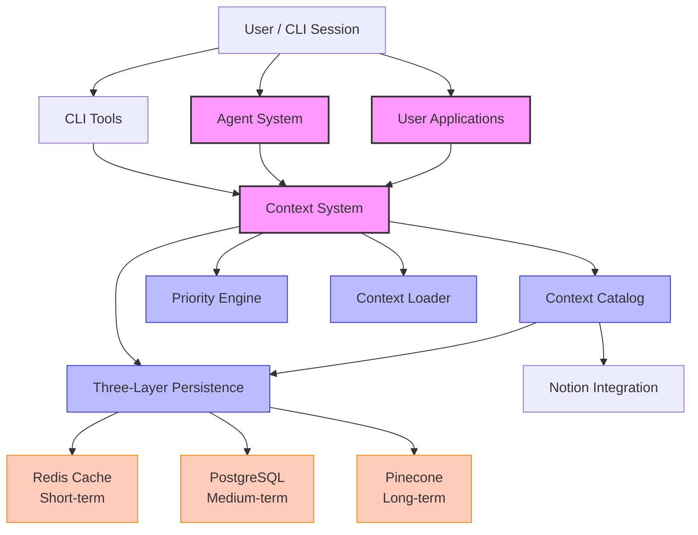
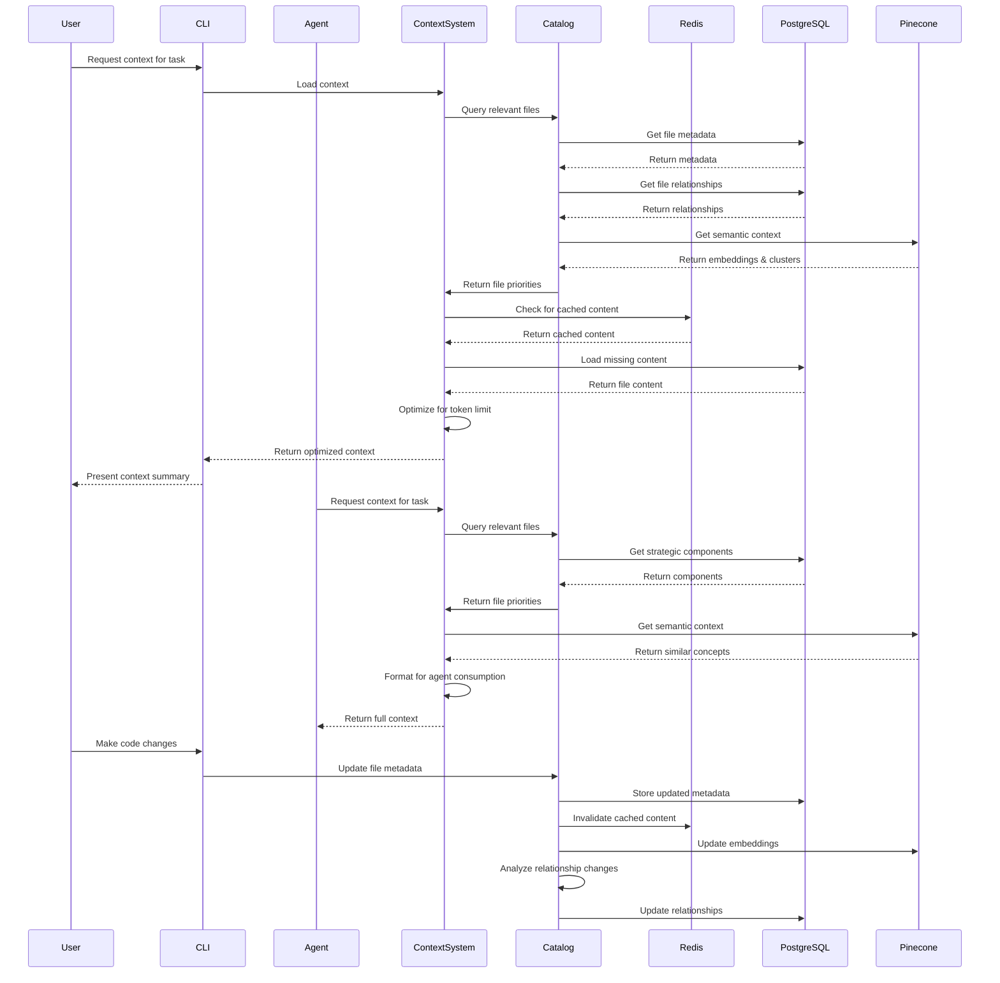
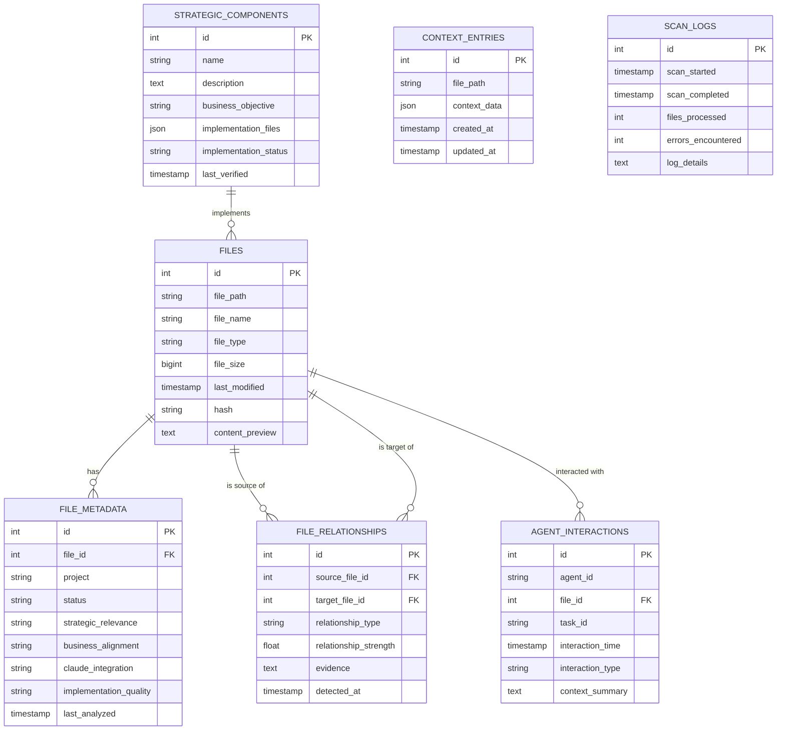

# SecondBrain Full Context Architecture

This document provides a comprehensive overview of the complete SecondBrain context architecture, showing how the Context Catalog System integrates with the existing Three-Layer Persistence architecture.

## Core Architecture Overview



## Detailed Component Architecture

```mermaid
graph TD
    %% Main Systems
    CS[Context System]
    
    %% Three-Layer Persistence Components
    TLP[Three-Layer Persistence]
    TLP --> Redis[Redis Layer]
    TLP --> PostgreSQL[PostgreSQL Layer]
    TLP --> Pinecone[Pinecone Layer]
    
    %% Redis Components
    Redis --> RC[Recent Context Cache]
    Redis --> HP[Hot Paths]
    Redis --> IS[In-Session State]
    
    %% PostgreSQL Components
    PostgreSQL --> FM[File Metadata]
    PostgreSQL --> FR[File Relationships]
    PostgreSQL --> SC[Strategic Components]
    PostgreSQL --> BM[Business Mapping]
    
    %% Pinecone Components
    Pinecone --> SE[Semantic Embeddings]
    Pinecone --> KC[Knowledge Clusters]
    Pinecone --> CV[Concept Vectors]
    
    %% Context Catalog Components
    CC[Context Catalog]
    CC --> Scanner[File Scanner]
    CC --> RelMapper[Relationship Mapper]
    CC --> StrategicAnalyzer[Strategic Analyzer]
    CC --> Visualizer[Visualizer]
    
    %% Context Loading Components
    CL[Context Loader]
    CL --> TaskAnalyzer[Task Analyzer]
    CL --> SessionTracker[Session Tracker]
    CL --> TokenOptimizer[Token Optimizer]
    CL --> ContextFormatter[Context Formatter]
    
    %% Priority Engine Components
    PE[Priority Engine]
    PE --> FileRanker[File Ranker]
    PE --> RelScore[Relationship Scorer]
    PE --> BizPriority[Business Priority Calculator]
    PE --> LoadBalancer[Context Load Balancer]
    
    %% Connections
    CS --> TLP
    CS --> CC
    CS --> CL
    CS --> PE
    
    %% Cross-Component Connections
    Scanner --> FM
    Scanner --> SE
    
    RelMapper --> FR
    RelMapper --> SE
    
    StrategicAnalyzer --> SC
    StrategicAnalyzer --> BM
    
    TaskAnalyzer --> SC
    TaskAnalyzer --> BM
    
    FileRanker --> FM
    FileRanker --> SC
    
    RelScore --> FR
    RelScore --> SC
    
    BizPriority --> BM
    BizPriority --> SC
    
    TokenOptimizer --> RC
    TokenOptimizer --> HP
    
    SessionTracker --> IS
    SessionTracker --> HP
    
    %% Styling
    classDef primary fill:#f9f,stroke:#333,stroke-width:2px;
    classDef secondary fill:#bbf,stroke:#33f,stroke-width:1px;
    classDef tertiary fill:#bfb,stroke:#3f3,stroke-width:1px;
    classDef storage fill:#fcb,stroke:#f80,stroke-width:1px;
    
    class CS,TLP,CC,CL,PE primary;
    class Scanner,RelMapper,StrategicAnalyzer,Visualizer,TaskAnalyzer,SessionTracker,TokenOptimizer,ContextFormatter secondary;
    class FileRanker,RelScore,BizPriority,LoadBalancer tertiary;
    class Redis,PostgreSQL,Pinecone,RC,HP,IS,FM,FR,SC,BM,SE,KC,CV storage;
```



## Data Flow Architecture



## Storage Schema Architecture



## Integration with CLI Tools

The context system is integrated with the CLI through several commands:

```bash
# Load context for current task
.cl/context load --task=implement-feature-x --depth=3

# Map file relationships
.cl/context map --file=/path/to/file.js --type=imports,conceptual

# Get strategic overview
.cl/context overview --project=TubeToTask

# View drift report
.cl/context drift --component=context-system

# Create visualization
.cl/context visualize --system=agent-workflow --output=notion

# Analyze optimization opportunities
.cl/context optimize --focus=token-usage

# Run catalog maintenance
.cl/context maintain --full
```

## Integration with Agents

Agents interact with the context system through a standardized API:

```javascript
// Agent requesting context
const context = await contextSystem.getContextForAgent({
  agentId: 'planner-agent',
  taskId: 'implement-feature-x',
  sessionId: 'user-session-123',
  maxTokens: 100000,
  priorityParameters: {
    strategicFocus: 'high',
    implementationFocus: 'medium',
    businessFocus: 'high'
  }
});

// Using context in agent reasoning
const reasoning = `
Based on the context loaded, I can see that:
1. The feature requires changes to ${context.files.length} files
2. The most critical file is ${context.files[0].path}
3. This feature aligns with ${context.businessObjective}
4. The implementation should follow the pattern in ${context.patternFile}
`;

// Agent updating context
await contextSystem.updateAgentContext({
  agentId: 'executor-agent',
  taskId: 'implement-feature-x',
  updates: [
    {
      filePath: '/path/to/modified/file.js',
      changeDescription: 'Added new function to handle feature X',
      impactAssessment: 'Medium - affects 3 dependent files'
    }
  ]
});
```

## Conclusion

The complete SecondBrain context architecture provides a comprehensive system for:

1. **Full Knowledge Preservation**: Never truncates or simplifies essential context
2. **Strategic Alignment**: Maps all system components to business objectives
3. **Optimized Context Loading**: Prioritizes context based on task and business needs
4. **Relationship Tracking**: Maintains complete relationship maps between components
5. **Multi-Layer Persistence**: Leverages the three-layer architecture for optimal storage
6. **Agent Integration**: Provides rich, optimized context to all agents
7. **Human Oversight**: Maintains transparency through Notion integration

This architecture fully satisfies the requirements of the Prime Directive, ensuring that the complex, comprehensive nature of the SecondBrain system is preserved across all interactions.